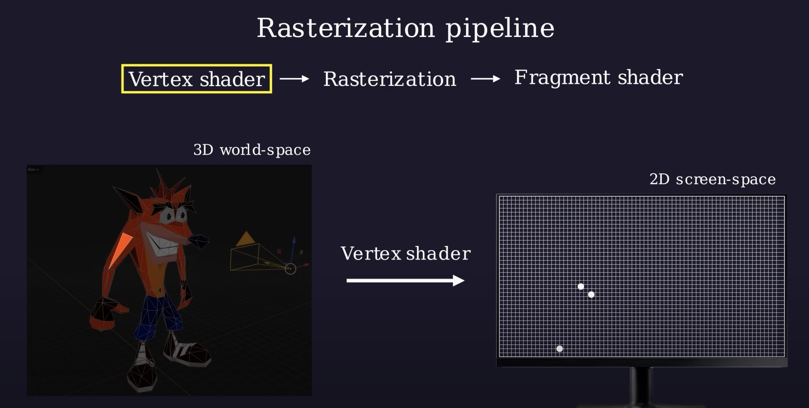
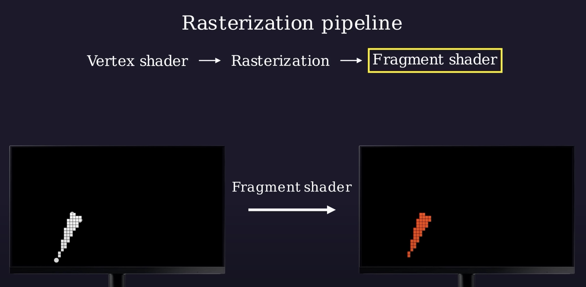

# Shaders

## What are shaders?

Shaders necessary for real time rendering of graphics, from computer games to all kinds of visual effects.

### <font color=cyan>If you play video games this will make sense. ***All 3D objects in games and 3D experiences have shaders attached to them, this is its material. The `Shader` will determine the colour of the object, how the lighting bounces off the objects, effects that the object will have, etc...***</font>

### In Short

A shader is a small program that runs entirely on your devices ***`GPU (Graphics Processing Unit)`***, rather then on the ***`CPU (Central Processing Unit)`***. It makes our experiences extremely fast as the GPU can manipulate multiple points on graphics simultaneously.

<font color=magenta>They take advantage for GPU rendering to process many pixels and vertices at once in parallel, which makes them fast and great for computer graphics and graphics manipulation like, generating noise, applying filters like blur or glitches, and or shading polygons.</font>

<br />

## Elaborating on what shaders are

<font color=gold>Shaders are a combination of 2 functions and or concepts that work together to draw both 2D and 3D content onto a canvas/screen.</font>

In Three JS

***Shaders are used to colour in the space contained withing the space of a geometry.***

Shaders consist of 2 Parts that are required for it to run.

- `A Vertex shader`

    ```glsl
    void main() {
        gl_Position = projectionMatrix * modelViewMatrix * vec4(position, 1);
    }
    ```

    <br />

    <font color=gold>This shader is a function that is run once for every vertex within a geometry.</font>

    <br />

    

    <br />

    It is responsible for setting the GL position of our geometry vertices. (This will determine the `x, y,z, w` coordinates that represents a position on the screen)

    ```glsl
    vec4(0.6, 0.7, 1.0, 1.0);
          x    y    z    w
    ```

    With this we can manipulate the vertex position programmatically allowing us to manipulate our spaces vertices simultaneously since this operation is running on the GPU. This is would it would look like when the positions are being manipulated with a displacement function:

    <video src="./assets/DisplacementFunction.mov" width="320" height="240" controls></video>


- `A Fragment shader`

    ```glsl
    void main() {
        gl_FragColor = vec4(1.0, 0.0, 0.0, 1.0);
    }
    ```

    <br />

    <font color=gold>This shader is a function that will run once for every pixel within our geometry</font>. Its purpose is to set the colour of the pixel it is looping over in RGBA format.

    <br />

    

    This can be used to set a simple colour but it can also be used to create highly customizable special effects for objects, images and entire canvas elements

    

<br />

Shaders are written with `GLSL (Open GL shading language)` which resembles low level C

<br />

## Coding shaders

We can provide data to our shaders from code running on the CPU (ie - JS files) using `uniforms`. These values will stay constant each time the shader is run and is able to share data with both vert and frag shaders.


We can also pass in attributes to our vertex shaders only using `Attributes`. These can hold information that can vary per vertex in the shader. This varying information can be the vertex position and colour.


Both attributes and uniforms are read only so they cannot be mutated from within the shader.

<br />

We can cross communicate from our vertex shader to our fragment shader using `varyings`. These varyings are set in the Vertex shader and are read in the fragment shader where they are `read only`. (This is how a texture a coordinate is passed from the vertex where all the vertex points are stored to the fragment shader where colour will be given to the point)


<br />

These tools (varyings and uniforms) allow us to add interactivity to our shaders. We can utilize JS generated data like mouse movement, mouse positioning, mouse events like click, and key presses to make some animation or change in the shader.

<br />

Here is a resource where we can see shaders being applied to images -> [Video](https://www.youtube.com/watch?v=gGvYq6baFiQ)

<br />

## What are shaders used for?

Shaders can be used for many things but here is just a list of a few of those things:

- It can be used to make strands of grass move and give the experience a feel that there is wind causing the grass to sway.

- It can make grass and other object deform when there is a character or object close to it.

- It can be used to create visual effects such as glitches, modifying pixels to create particle effects, and modifying geometry meshes to create ripple effects like ripples in water. 

- Generate reflections

<br />

The book of shaders is the most popular resource for learning and implementing shaders into your applications. [The book of shaders](https://thebookofshaders.com/)

<br />

### Shaders can be written with these tools:

- [P5.js](https://p5js.org/reference/#/p5/shader) -> These are the P5.js Shader reference docs

- [ThreeJS](../ThreeJS/ThreeJS.md)

- [Pixi.js](https://pixijs.com/8.x/examples/mesh-and-shaders/textured-mesh-advanced)

<hr />

### Notes

Shaders in JS with vertex and fragment shaders allow us to animate multiple point on a cartesian plane at one time. JS can only animate one position at a type C++ Canvas shader programming allows us to create these virtual experiences and animations.

Mesh basic materials are ways to give basic colours and styles to geometry in our 3D plane this basic mesh is a shader under the hood and is provided to us to use as a pre-made shader. 


There are a few take away's here. First is that <font color=gold>ALL MATERIALS RELY ON SHADERS FOR THEIR DEFINITION (basically) (CODE THAT RUNS ON THE GPU - The pre made material shaders are provided to you with the prefix Material so you know they are shaders. YOU DO NOT NEED TO RECREATE THESE IT'S UNNECESSARY - I'm LOOKING AT YOU MARCEL! XD)</font>

ThreeJS built in graphics libraries have their own shaders and materials if you want a out of the box solution.

<font color=gold>Shaders and meshes are are closely related. A Material is a high-level concept that includes shaders along with additional properties such as texture maps, colours and other parameters that define the appearance of an object's surface. A material uses shaders to render these properties onto the 3D scene.</font>

<br />

Here are some cool camera visual manipulations done with shaders in P5.js 

[Resource 1](https://shader-with-webcam.glitch.me/)

[Documentation](https://itp-xstory.github.io/p5js-shaders/#/./docs/examples/image_effects)

<br />

<br />

### What is a mesh?

A mesh is <font color=cyan>A collection of vertices, edges, and faces that define the shape of a polyhedral object in 3D computer graphics. Meshes are used to represent the geometry of objects in a 3D space.</font>

**Shaders can be applied to meshes** to control their appearance!

<br />

<br />

### Cool Information on shaders in the Game world

### Rasterization pipeline For a simple 3D rendering process in the chain (For a little knowledge dump)

Objects go through a 3 phase process:

    Vertex Shader -> Rasterization -> Fragment shader

1. The first step in the process is the vertex shader step. The vertex shader will allow us to take a 3D object and break it into triangle vertices in a 3D plane and as this is happening the triangle vertices will be mapped to a 2D projection plane, using the camera position and orientation.



2. The second step is rasterization that will take the point and figure out which pixels in the triangle on the 2D plane to fill in as part of the triangle. These pixel points are called `fragments`.


3. The last step is where the fragment shader will pick up these pixel fragments on the 2D plane projection and calculate the manner in which the should be displayed. This often is the time in which colour is given to the fragments. The Fragment shader normally uses information from the vertices and external light sources to shade the pixels accordingly to give it the necessary colour.



This processes is then repeated for all triangles within the original object. ***<font color=cyan>Triangles are normally used since they are the shape that can generate polygons with the least about of vertices. This makes the triangle a computationally and memory optimal/efficient shape</font>*** because of these they are ease to process in parallel on GPU's!!!!!!!!!!!!!!!!!!!!!!!!

<br />

<br />

# Shader Generative Art

Shader generative art coding is all about using math, mathematical function and algorithms to create patterns and manipulate pixels to create insane visual effects.

<font color=cyan>It's a unique fusion of Art and Science.</font>

Shaders manipulate each pixel and vertices on a canvas! They work by taking inputs such as the position of the current pixel and performing logic to move them or determine a colour for them.

Fragment shaders take a pixels `x and y` position coordinates and maps them to a colour output which is represented by a `rgba` value. (red, green, blue, and alpha channels) Since we are working in GLSL this is running on the GPU and the function is thus calculated in parallel for every pixel on the screen, mean millions of calculations are performed in a short time frame.


<br />

# [Ray Algorithms](./Rays/RayAlgorithms.md)

Ray Casting: A simpler form of ray tracing used in games like Wolfenstein 3D and Doom that fires a single ray and stops when it hits a target.

Ray Marching: A method of ray casting that uses signed distance fields (SDF) and commonly a sphere tracing algorithm that "marches" rays incrementally until it hits the closest object.

Ray Tracing: A more sophisticated version of ray casting that fires off rays, calculates ray-surface intersections, and recursively creates new rays upon each reflection.

Path Tracing: A type of ray tracing algorithm that shoots out hundreds or thousands of rays per pixel instead of just one. The rays are shot in random directions using the Monte Carlo method, and the final pixel color is determined from sampling the rays that make it to the light source.

<br />

[Tutorial on Ray algorithms](https://inspirnathan.com/posts/52-shadertoy-tutorial-part-6)

<br />

<br />

---

### Notes:

***GLSL is a strongly typed language that is why you will see a lot of decimal points when working with glsl code.***

***Vector Swizzling*** is the act of converting vec3 and or vec4s down to lower vectors by adding values from greater vectors
together.

```glsl
vec3 position3D = vec3(...);  <!-- This holds a X Y and Z value as a vec 3 -->

<!-- We can do this to convert the 3D position to a 2D position -->
vec2 pos2D = position.xy;

<!-- If you wanted to Swizzle vector points in the same vector you could do this -->
vec4 colour = vec4(...); <!-- This holds R G B and A values as a colour vec4 -->

<!-- If you wanted to switch the position of the r and b values we can do this -->
colour = colour.bgra; 
```

<br />

***Many values in glsl are normalised.*** Which means they are values from ***`0 to 1`***. For example we think of colour as a value from ***`0 to 255`*** 

If we wanted white we would use `(255, 255, 255)` for each colour channel, but within shaders we would represent white as follows `(1.0, 1.0, 1.0)`

<br />

# Signed Distance Functions

This function is a common function used to create shapes in the fragment shaders when using WebGL or OpenGL.

The upside to using SDF is that it is versatile and gives us the ability to create a wide variety of shapes with relatively simple math functions. SDFs also enable easy implementations of effects like soft shadows, glow, and outlines which can be computationally expensive with other techniques.

***SDF*** -> Signed Distance Functions. It is a function that tells you how far away from a shape you are at every single point in the scene.

### What are the other methods to drawing shapes in a shader?

#### Analytic Shapes: 

Directly compute the shape's area by using mathematical equations. For example, a circle can be drawn by checking if a point lies within its radius from the center.

#### Polygonal Approximations: 

Use equations to define the edges of polygons (triangles, squares, etc.). This method can be more straightforward but might not offer the smooth edges that SDFs provide.

#### Texture-Based Shapes: 

Use textures to define shapes. This method involves mapping a texture to geometry and using the alpha channel of the texture to create transparent areas, effectively shaping the visible part of the texture.

#### Ray Casting in Shaders: 

For 3D shapes, ray casting can be used to determine the intersection of a ray from the camera to the pixel with the shape. This method is more complex and computationally intensive but allows for rendering 3D shapes directly in the shader.

#### Procedural Generation: 

Combine mathematical functions to generate shapes procedurally. This can include fractals, noise functions, and other algorithmic approaches to create complex and interesting patterns and shapes.

#### Gradient and Masking Techniques: 

Use gradients and masks to create shapes by manipulating the alpha channel or by using stencil operations. This can be a simple way to create soft-edged shapes or complex patterns.

<br />

***<font color=gold>A Voxel is a volumetric pixel. A pixel is 2D and a Voxel is a 3D representation of the 2D pixel</font>***

[Here is a resource on Voxels](https://www.youtube.com/watch?v=dSDuR-45W6Y)

<br />

### Shader Toy

Shadertoy was made to showcase all kinds of mathematical equations in the fragment shader, so there’s no geometry to speak of. Only math functions. As such it does not use 3D geometry but the `Ray` algorithm. [Ray Marching](./Rays/RayAlgorithms.md#ray-marching) to create these 3D visual effects.