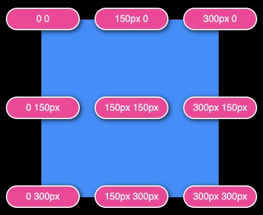

# GSAP 3 Express

GSAP 3 give us a **_gsap_** object that will be our access point to everything the engine does. It allows us to:

- Create animations.

- Configure settings.

- Register plugins, eases and effects.

- Gives us global control over all animations.

<br />

This object has 3 main methods for creating **_Tweens_** and optionally adding them to **_Timelines_**:

- _gsap_.to()

- _gsap_.from()

- _gsap_.fromTo()

<br />

### What is a Tween?

A tween is the process of generating intermediate frames between two states to give the appearance of evolution from the first state to the second.

Its used to change a single property of a single object over time. => It's short for **_betweening_**. IE) the space in between the two states.

For example if we change an elements opacity, we might use a tween to get it from 0 to 1 to fade it in.

**_Note:_** For the best performance when using Tweens use CSS Transforms and opacity. Although GSAP **_can animate any numeric property_** like:

- width and height.

- top and left position values.

- borderRadius

- color

- vh, vw

- etc...

<br />

<font color=gold>We can inspect our animations with a **Virtual Playhead** that allows us to rewind, pause or fast forward animations</font>

These tweens and timelines can act on multiple elements at the same time! We can also give this more complexity by staggering the time in which the animations for the different selected elements in the target group act.

<br />

## Concepts and Properties

##### We can use delay and repeat as special properties for repeating animation or delaying them for a few seconds depending on your preferences.

[Here is an example of these being used](./gsapExamples.js)

##### Easing allows us to adjust the accelerating and decelerating of our animations to make them more custom

[Here is an example of eases being used](./examples/gsapExamples.js) If you look at the h1 animation you can see it has a ease of bounce. Notice what happens when the html DOC loads.

If we want to specify when the ease will act on the animation we can supply the following _.property_:

```js
{
  ease: "bounce.in";
}

{
  ease: "elastic.out";
}

{
  ease: "back(6).inOut";
}
```

#### Eases

Eases are configurable as we see in the above code block with `back(6)`, here we are making the animation more drastic.

##### Understanding ease curves

Easing dictates the rate of change of an animation and the direction of the change (bounce, back, linear, elastic, etc...)

Flat ease curves will cause slow rates of change and steep curves will cause quick rates of change.

**_NB: In summary Ease curves dictate the rate of change within an animation_**

#### <font color=gold>You can create your own ease curve using the Custom Ease function. [Here is a ease curve visualizer to try out](https://gsap.com/docs/v3/Eases)</font>

<br />

#### Why from() Tweens glitch and stop working

_glitch.jpg>)

This is not a glitch more as it is a logical understanding flaw. The issues here is that we are scaling from 0 to a value that is random and will always change. A few to fix this is to use a `.fromTo()` to define the start and the end of the animation.

Here is how we would fix it

```js
const tween = gsap.fromTo(
  bg,
  { scale: 0, duration: 1 },
  { scale: 1, ease: "circ" }
);

button.addEventListener("mouseenter", () => {
  tween.restart();
});
```

<br />

#### Transform Origin

The transform origin is a point around which transforms like _rotation, skew, and scale_ will be applied.

It is defined as a pair of horizontal(x) and vertical(y) axis values.

DOM elements have their center being the transformOrigin _50% (x) 50% (y)_ OR we can use the keywords to represent the origin `center center => 50% 50%`

<br />



<br />

## Timelines

### What is a Timeline?

**_<font color=lightgreen>A timeline is a container for tweens</font>_**. This allows us to control them as a whole and precisely manage their timing. In summary you can control multiple tweens as a single unit. (Specifically to make animation sequencing a breeze)

### Why should we use it?

This tool allows us to create complex animations in a manageable way.

It allows us to have the following super powers:

- Sequencing:

- Control: When we pause, resume, reverse or seek to any spot in the animation we can perform this for all animations in the timeline instead of having to perform them one at a time.

- Nesting: We can have deep levels of control since we can nest timelines within timelines.

- Relative timing: Timelines allow for relative timing, which means you can start an animation while another is playing or afterwards if you do not need the animation overlap.

<br />

# Dealing with FOC (Flashes of content)

This is the concept of content flashing on the screen which is a result of the page loading before your javascript can run causing the user to see the content before it is animated.

#### How do you deal with this issue is to prevent the content from being shown until the content is loaded on the page with JS. We will hide the content with CSS until that point where the load event is triggered in the JS DOM.

<br />

# Keyframes in GSAP

This animation style for timelines works the same way it does within CSS, although now we can use the power of GSAP animations with the power of Keyframe animations.

Here is an example of what this looks like in code:

```js
const tl = gsap.timeline();

tl.to('.slime', {
    keyframes: {
        "25%": { y: 0 },
        "50%": { y: -100, ease: 'sine' },
        "75%": { y: 0, ease: 'power1.in' },
        "100%": { x: 320, ease: "bounce" } // The object holds the properties of the animation that will occur at the 100% position of the animation
        easeEach: "bounce"
    }
    duration: 3
})
```

#### A major draw back to using key frame animation is adjusting the timing after you have created your animation as you will need to adjust the percentages which can be tedious as you need to be precise.

This is the difference point between `keyframes` and `timelines`. 

### *Timelines* are necessary for the precise orchestration of multiple tweens on multiple target elements. While *Keyframes* add super powers to individual tweens. They can be used together to create master pieces.