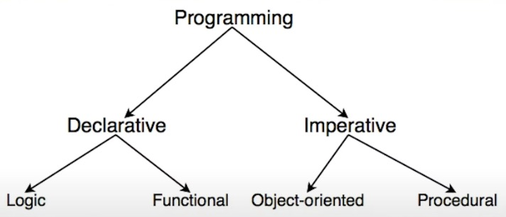
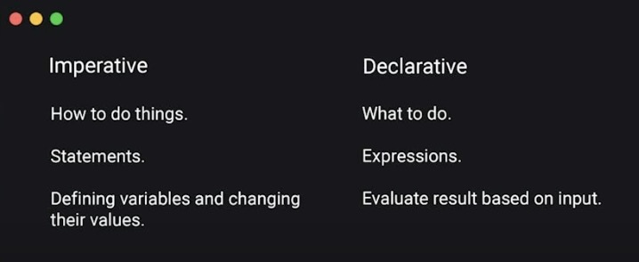

# Green Stock Animation Platform (GSAP)

For my animation and transition journey!

## GSAP vs FRAMER Motion

### GSAP PROS (Most popular creative development tool)

GSAP is extremely powerful and It has built in modules to add custom out of the box animations to your applications. (These are free and paid for) Note: These animations and modules are not things that you would not be able to build yourself, they will just save you time.

GSAP is extremely `versatile` as it is framework agnostic. It can be used with multiple JS frameworks even vanilla JS.

GSAP has a `large developer community` of creative devs working on cool features, this can help you debug all your problems easily.

GSAP has `Timelines` that allow you to make sequenced animation. This is a animation that has multiple steps. For example, fade this in then do this and then animate this into view. These timelines allow us to reverse the animation if we want to as well. This can be plugged into the browser history forwards and backwards events to rewind a forward animation when we go backwards in the history.

<video src='./assets/sequence_animation.mov' width="500px" height="500px" controls></video>

 

Framer does not have a tool to build timeline/sequence animations like this.

### GSAPs BIGGEST PROBLEM is its non seamless React Integration

There are a few things you need to do when working with react that you would not need to do when using framer motions. These are things like:

- Avoiding flashing of unstyled content (FOUC).

- Needing to clean up your animations when they are no longer being used.

- Needing to use the useGSAP hook to access the object.

 

## Framer Motion PROS

**React uses a declarative approach and so does framer motion.** GSAP uses an imperative approach. (Imperative implies class based approach to creating a styling object) Because of this Framer Motion is a tool that is tailored for React led application experiences.

 

When you use the different tools you need to start thinking differently about your solutions. Mixing and matching the paradigms with GSAP and React can be done but the solution will not have the best developer experiences and this is why.

 

When working with declarative tools for animations we can open a window to reducing the performance of your application. Since when you want to change visuals in react you need to change state and cause a re-render to then update the shadow DOM.

If we do this with the `request animation frame` we will be running the animation on every frame which WILL KILL YOUR APPLICATIONS PERFORMANCE!!!

 

FM has a tool to solve this issue - Motion Values - These are internalized values that are based on state and this allows us to only re-render the part of the application that is using the `motion value` and not the entire application.

FM also has a amazing tool for us to use called `Animate Presence`. (**GSAP DOES NOT HAVE THIS CAPABILITY CURRENT**) This is a wrapper component tool that allows us to animate when a component enters and leaves the DOM. This can be helpful to animate when you change pages in your application. (Since the whole page is leaving the DOM and a new page is entering)

An example of this can be animating the adding and done checking of TODO list items that will enter and exit the DOM. Another example of this would be building page transitions. (These are made easier with the `animate presence` tool, but they can be done using GSAP and other animation libraries)

<video src='./assets/TransitionExample.mov' width="500px" height="500px" controls></video>

 

Framer Motion is very lightweight in comparison to GSAP since Framer Motion is not a complete animation library (`THIS IS FRAMERS BIGGEST PROBLEM as it does not have the coverage that GSAP does and due to this it may cause you to take longer to create an animation then if you were to use GSAP`) like GSAP is. This can be a positive if you do not want the additional bloat that GSAP will bring to your application.

This means that in Framer Motion you need to think a bit more to make the animations that are already present in GSAP. This means you can learn more about how animations work behind the plug-ins so that you can become less dependent on GSAP.

 

## Discussion Conclusion

If you are working with a react framework based application we should use Framer Motion.

If you are working with a non react application / frame work then we should use GSAP.

### ***We should learn both of these tools as they are both needed in there specific contexts.***

 

### Notes for using GSAP in React

When we use GSAP in react we should run our animation code inside a `useGSAP` or `useLayoutEffect` since we want the animation to be present before the DOM markup is rendered.

This will prevent FOC!

Since GSAP is imperative we need to use refs and supply these ref's to our elements so that that we can use them with our GSAP instance to allow us to create animations for our components. (the ones we have referenced) This needs a `useGSAP OR useLayoutEffect` to ensure we don't encounter any bugs.

`Framer` is declarative which allows us to bake this into our markup when it is defined.