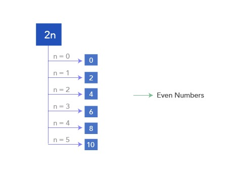
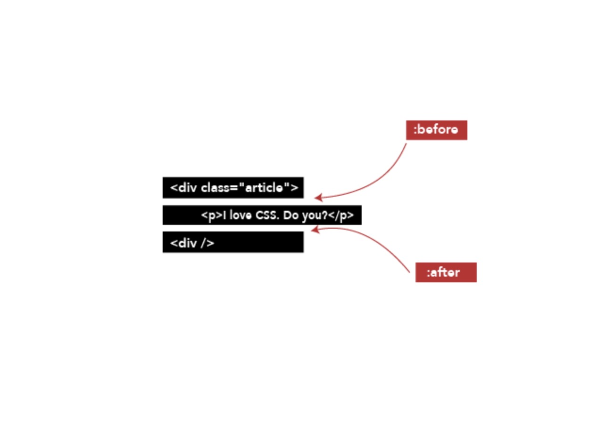
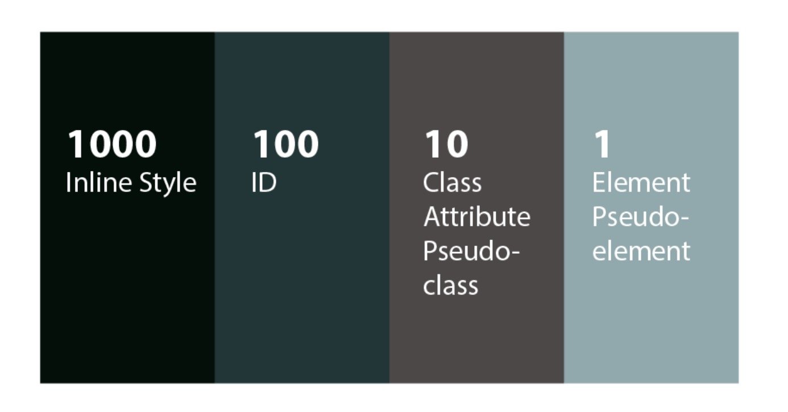

# CSS

Here are some killer CSS references:

- [CODROPS](https://tympanus.net/codrops/css_reference/) **_it's AMAZING_**

- [MDN](https://developer.mozilla.org/en-US/docs/Web/CSS/Reference)

### Helpful tips

Important CODING Principles to follow when you get stuck:

- Be Calm

- Use the process of elimination

- Tap a break, a nap or take a creative pause

- Seek help

<br />

## Pseudo Selectors

Pseudo selecting is a css element selection method that involves the `colon (:)` syntax.

IE)

```css
h1:hover,
h1:active {
  color: red;
}
```

We need to ensure that the order of our pseudo selectors flow the `LVHA` naming order break down:

- `:link`

- `:visited`

- `:hover`

- `:active`

There are more selectors that allow us to target the children of a particular parent element:

```css
/* FIRST CHILD */
li:first-child {
  /* This will provide styling for the first child of a list */
}

/* LAST CHILD */
li:last-child {
  /* This will provide styling for the last child of a list */
}

/* ONLY CHILD */
li:only-child {
  /* This will provide styling for the only child of a parent */
}
```

The outlier pseudo selector here is the `Nth-child` selector. This selector will allow us to use the nth value and style whatever combination of numbers we wish to out there.

We can also provide preset values for selecting all odd and even numbers and we can also use it to select a single element.

EG)

```css
li:nth-child(odd) {
  /* This will add the styles to all odd children under the parent */
}

li:nth-child(even) {
  /* This will add the styles to all even children under the parent */
}

li:nth-child(2) {
  /* This will add the styles to the second child under the parent li */
}
```

If you want to use the undefined variable n to create a sequence selector for values that meet the criteria we can use the following. (Remember this `n` variable allows us to use basic math to select our children)

EG)

```css
li:nth-child(2n) {
  /* This will style all even children, just like the key word even would */
}

and li:nth-child(2n + 1) {
  color: red; /* For odd children styling */
}
```

IE)



<br />

### Selector best practices

1. Use type selectors when all or most instances of an HTML element needs to be styled in the same manner. `(h1)`

2. Use class names as a way to select elements in more specific groups for reusability and flexibility as apposed to type selectors. `(.class-name)`

3. Use IDs for uniquely appearing elements that are not duplicated across the application. `(#id-for-element)`

4. When using descendent selectors do not go more then 3 levels deep. IE)

```scss
√ Acceptable div .red-letters {
  color: red;
}

X Not Acceptable div .red-letters h3 p {
  color: red;
}

// This slows down your style resolution and makes your code messy and unreadable.
```

<br />

#### There are more pseudo selectors like `:before` and `:after` that are used to insert styles and html code (text) into a position that is relative to the element selected.

For example if we did this:

```html
<div class="article">
  <p>I love CSS. Do you?</p>
</div>
```

```css
.article:before {
  content: "Yes, I do";
}

.article:after {
  content: "No, I don't";
}

/* Will result in */

-> Yes, I do I love CSS. Do you? No, I don't
```



**NOTE:** If you use `:before OR :after` you MUST specify a content value even if no content is going to be added -> IE):

```css
.article:before {
  content: "";
}
```

**NOTE:** <font color=red>When you use these pseudo elements they are not appended to the DOM they are just visually displayed, so do not rely on them or use them for content that is important use this for styling and adding cool animations and features to your HTML elements rather</font>

<br />

Another type of selector to keep in mind are `Attribute` selectors and these can select elements based on any criteria. They are super useful when you want to be very detailed or creative with your selections of elements.

<br />

**NOTE:** Browsers do have their own styling for elements so we need to ensure we either override those styles or create a style reset file where we can set all of the default preset for our application.

<br />

## Cascades In CSS

The Cascades in CSS (cascading style sheet) comes from the concept of cascading. **_This concept shares similarities with inheritance_**

In short **_inheritance_** applies to DOM nodes and them inheriting from the relationships, think Parent child relationships for HTML elements.

The **_Cascade_** Is about the relationship between multiple stylesheets.

_This can be annoying. If you have multiple style sheets this means that the styles defined in one will be passed down to all other style sheets. (The styles cascade/fall down from one sheet to another)_

<font color=lightgreen>In even shorter: The fact that multiple stylesheets can affect the same document revolves around the concept of cascade in CSS. Think the ability for the browser to already have default styles and us creating our own style sheet to override those styles. This is as example of 2 stylesheets effecting the same DOM application. This is `Cascading`!!!!!!!!!!!!!!</font>

<br />

Ordering of our style declarations matter, if you place conflicting styles together the last style declared will take prescidance.

IE)

```css
/** Initial styling */
h1 {
  color: black;
}

/** MORE STYLES */
/** ... */
/** ... */

/** Override */
h1 {
  color: red; /** This style will override the style that was defined higher up in the style sheet */
}
```

When working with the ordering of styles it's also important to understand that the specificity of your selectors also determine their hierarchy and determine which style will be the one that is used for example:

```css
header h1 {
  color: red;
}

h1 {
  color: blue;
}
```

-> Although the header h1 falls in with the h1 selector from the second style declaration we will have our h1 be coloured red since the specificity of the `header h1` selector is greater then that of the `h1` selector.

You can think of these selectors being given points.

Here is this arbitrary points system and how it determines which styles take presidents over others.



<br />

# [Colors](./colors.md)

<br />

# [Typography](./typography.md)

<br />

# [Units](./units.md)

<br />

# Background

When using the background style property, we can use it to add a background image to our application without defining the image in our html or js code.

We have a few properties we can use to manipulate this image. For example we can use `background-repeat` to repeat our image in the x axis with `repeat-x` or in the y with `repeat-y` or to not repeat at all with `no-repeat`.

The background-size property can be used to size the image according to your needs.

There are 3 main object fit sizing keywords we can use for background images and many other objects:

- _cover_ (NB: The aspect ratio of the image is kept the same as the original)

  This will cover the entire space required!

- _contain_ (NB: The aspect ratio of the image is kept the same as the original)

  This will contain the image within the space required and if there is space left over the image will be repeated.

<br />

Not we can still size our images with normal css units of measurements:

```css
p {
  background-size: 150px 200px;
}

p {
  background-size: 50% 50%;
}

/* THIS IS WRONG: (We can not provide negative lengths) */
p {
  background-size: -150px -200px;
}
```

<br />

### We can adjust our background positioning with the:

```css
div {
  height: 100%;
  background-image: url("http://i.imgur.com/ThtOO8z.png");
  background-repeat: no-repeat;

  /* With the x and y values below👇 */
  background-position: 200px 50px;
}
```

This can either use keywords like below or px values as above, or even percentages:

```css
div {
  background-position: bottom left;
}
```

<br />

### Background Shorthand


This will allow us to define all of our background styles in a single style line.

Which means we go from this:

```css
.bg {
  background-image: url("path/to/image.png");
  background-position: 50% 50%;
  background-size: cover;
  background-repeat: no-repeat;
}

/* TO THIS */
.bg {
  background: url("path/to/image.png") 50% 50% / cover no-repeat;
}
```

<br />

### Border Box Sizing

This is a style that allows us to not relatively grow the size of the box when adding padding and border styles.

```css
div {
  box-sizing: border-box; /* This is referring to the css Box Model */
}
```

This will allow our box model to retain its size, while we add padding and border styles to the element.

<br />

### Variables

Variables in CSS are now native and they work the same as they do in our Sass (css preprocessor) they just have different syntax. A syntax example can be seen below:

```css
div {
  --bgcolor: teal;
  --color: red;
  width: 200px;
  height: 200px;
  display: inline-block;
}

div.test {
  background-color: var(--color);
  color: var(--color)
}

div.ew {
  background-color: var(--color);
  color: var(--color)
}
```

**NOTE:** In css we need to use the `var()` method syntax to allow the usage of variables in css. 

And remember you can store more then just colours in these css variables:

```css
/* Example of setting a size variable */
:root {
 --size: 20
}

div {
   font-size: var(--size)px
}
```

<br />