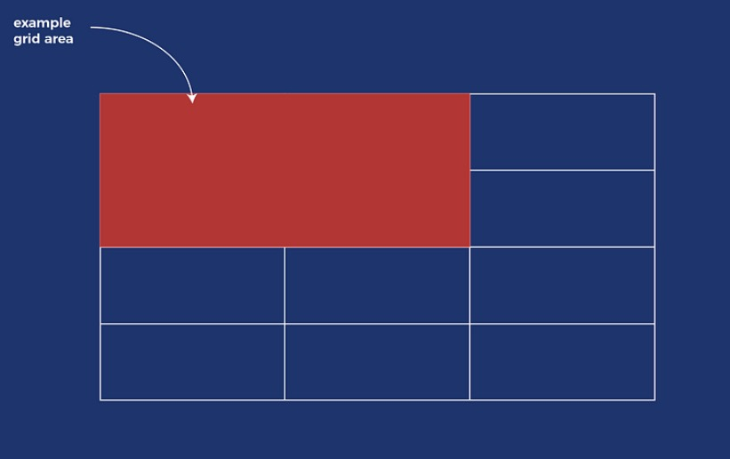

# Positions

- **Static Positioning:**

  This is the default position value where elements are positioned according to the natural flow of the DOM

- **Relative Positioning:**

  This is a value that will adjust only the position of the element and does not affect the position of the surrounding elements. It's used to offset and element without any by products.

  This is also used to give a parent point for values to be positioned `absolutely`. If a container is positioned `relative` then an `absolute` element inside that container will be positioned `relative` to the container that is positioned `relatively`.

- **Absolute Positioning:**

  This value states that the element will be positioned `relative` to the nearest **_`relatively positioned OR generally positioned ancestor/parent element`_**, This is different from fixed positioning as `fixed` is relative to the viewport and not another element. _(This is like the difference between rems and ems)_

  **_NOTE:_** <font color=gold>If there is no positioned ancestor for the absolute positioned element then it will use the DOM body as the ancestor in which it will use the viewport like a `fixed` positioned element, BUT it will not remain on the page. It will scroll with the content of the page.</font>

- **Fixed Positioning:**

  This value states that the element will be positioned relative to the viewport which means that it will always remain in view even if the user scrolls on the page.

- **Sticky Positioning:**

  This value states that the element will be positioned based on the user's scroll position. It is treated as `relatively positioned` until a offset position is reached in the viewport. If this position is met the element will then `'stick'` to the page in that offset position. **_(it basically goes from being positioned `relatively` to being `fixed`)._**

Here is an example of what each would look like within a style sheet:

```css
.element1 {
  position: static;
}

.element2 {
  position: relative;
  top: 20px;
  left: 20px;
}

.element3 {
  position: absolute;
  top: 20px;
  right: 20px;
}

.element4 {
  position: fixed;
  bottom: 20px;
  right: 20px;
}

.element5 {
  position: sticky;
  top: 0;
}
```

<br />

# Flex Box

Below are a few flex box properties and what they allow us to do:

- **flex-flow:**

  This is a shorthand and allows us to define the `flex-direction` and `flex-wrap` property at the same time

- **flex-grow:**

  This defines a element in the flex boxes ability to grow if necessary. It accepts a proportion that will dictate what amount of space inside the flex box container the element/item will take up.

- **flex-shrink:**

  This property defines the ability for a flex item to shrink if needed for responsiveness.

- **flex-basis:**

  This property defines the default size of a flex item before the remaining space is distributed evenly throughout the flex items.

- **flex:**:

  This is a shorthand for flex-grow, flex-shrink, and flex-basis combined. The second and third parameters (flex-shrink and flex-basis) are optional.

- **align-self:**

  This property allows the default alignment (or the one specified by align-items) to be overridden for individual flex items.

- **(justify-content, align-content, align-items):**

  These property aligns items along a axis. Values: flex-start (default), flex-end, center, space-between, space-around, space-evenly.

  align => (cross axis)

  justify => (main axis)

  The cross and main axis is defined by whatever the flex direction is. If the direction is row then X is the main access and visa versa for the column and Y becoming the main access. The cross will always be the opposite of whatever the main is.

Here is a stylesheet example:

```css
.container {
  display: flex;
  flex-direction: row;
  flex-wrap: wrap;
  justify-content: space-between;
  align-items: center;
}

.item {
  flex-grow: 1;
  flex-shrink: 1;
  flex-basis: auto;
  align-self: center;
}
```

<br />

# Grid

_NOTE: Css GRID and Flexbox can be used together to make cool designs and solve unique challenges!_

#### Difference between Grid and Flexbox:

**_<font color=gold>Grid is a 2-dimensional system that handles rows and columns at the same time. Unlike flex box which is considered 1-dimensional as it can only handle one of these tracks at a time</font>_**

### Terminology

- **Grid Item/Cell:**

  These are the rectangle space sections that will contain content in them. This is the smallest part of a grid

- **Grid Area:**

  This is a area made up of grid cells, it can be a singular grid cell or multiple grid cells combined

  

- **Grid Track:**

  This is the space between 2 grid lines. A fancy way of referring to grid _columns and rows_

<br />

### Properties

- **display:**

  This property is set to grid or inline-grid to create a grid container.

- **grid-template-columns, grid-template-rows:**

  These properties define the columns and rows of the grid with a space-separated list of values. The values represent the track size, and the space between them represents the grid lines.

  ```css
  body {
    ...
    grid-template-rows: 1fr 50px;
    grid-template-columns: 50px 1fr;
  }
  ```

- **grid-template-areas:**

  This property defines a grid template by referencing the names of the grid areas which are specified with the grid-area property.

  ```css
  body {
    grid-template-areas:
      "sidebar  content"
      "footer   footer";
  }
  ```

  This can almost be see as visually placing the gird-area section into a picture/format. Before we can do this successfully we need to have the different string above as actual: `grid-area` values on the items we which to place in that `grid template area`.

- **grid-template:**

  This is a shorthand property for grid-template-rows, grid-template-columns, and grid-template-areas.

- **grid-column-gap, grid-row-gap:**

  These properties define the size of the gap between the columns/rows.

- **grid-gap:**

  This is a shorthand property for grid-row-gap and grid-column-gap.

- **justify-items:**

  This property aligns grid items along the row axis.

- **align-items:**

  This property aligns grid items along the column axis.

- **justify-content:**

  This property aligns the grid along the row axis.

- **align-content:**

  This property aligns the grid along the column axis.

- **grid-auto-columns, grid-auto-rows:**

  These properties specify the size of any auto-generated grid tracks.

- **grid-auto-flow:**

  This property specifies how auto-placed items get inserted in the grid.

- **grid:**

  This is a shorthand property for grid-template-rows, grid-template-columns, grid-template-areas, grid-auto-rows, grid-auto-columns, and grid-auto-flow.

- **grid-row-start, grid-column-start, grid-row-end, grid-column-end:**

  These properties determine a grid item’s location within the grid by referring to specific grid lines.

- **grid-row, grid-column:**

  These are shorthand properties for grid-row-start/grid-row-end and grid-column-start/grid-column-end respectively.

- **grid-area:**

  This property gives an item a name so that it can be referenced by a template created with the grid-template-areas property.
