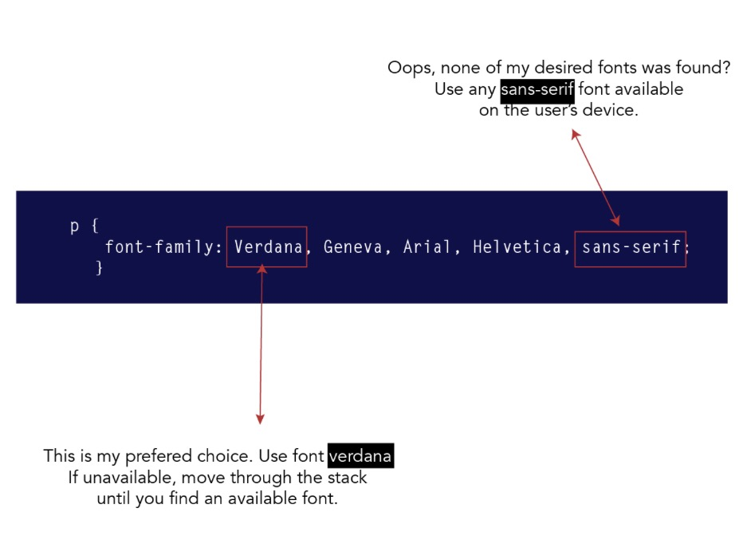

# Typography

**_Type_** <font color=gold>IS EXTREMELY IMPORTANT IN UI DESIGN AND IS VERY UNDER STATED AS TO HOW IMPORTANT IT IS FOR A DESIGN</font>

This is how you style text:

```css
p {
  font-family: Verdana;
}
```

**_Fonts come in many groups of families_**, Based on this family the browser will look up what font is available within that family on the users operating system and use it. This is in the event that we do not ship our type face with our code.

Here is a list of common font families:

- serif

- sans-serif

- monospace

- cursive

- fantasy

In most cases you will see a font-family defined in the stylesheet as below:

```css
p {
  font-family: Verdana, Geneva, Arial, Helvetica, sans-serif;
}
```

This is a fail safe and will tell the browser to use `verdana` if it's available and if not use `geneva` and if it can't find it, it will continue to try the list of type families until it reach one otherwise it will default to the browser default type family.



If you want to use the native devices font family we will need to specific the type family as our preferred type family for example:

```css
.system-font-stack {
  /* Notice -apple-system here */
  font-family: -apple-system, BlinkMacSystemFont, "Segoe UI", Roboto,
    Oxygen-Sans, Ubuntu, Cantarell, "Helvetica Neue", Helvetica, Arial,
    sans-serif;
}
```

<br />

NOTE: Serif and Sans-Serif are arguably the most popular font families in the world.

<br />

Here is an example of how to download and ship custom fonts for your applications. Note: you should be able to google this as fonts from different sources have different methods to using them, and you are not expected to know how to do this just understand what the concept is!

```css
/** Custom font face example */
@font-face {
  font-family: "MyCustomFont";
  src: url("MyCustomFont.woff2") format("woff2"), url("MyCustomFont.woff")
      format("woff");
}

body {
  font-family: "MyCustomFont", Fallback, sans-serif;
}
```

<br />

## Font face tips

- Generic font family names are `keywords` and should NOT be quoted unless they are custom or non generic:

  ```css
  /* Do NOT DO THIS !!! */
  p {
    font-family: Verdana, "sans-serif", "Roboto", -apple-system;
  }
  ```

<br />

- You should provide a generic font family name at the end of your font-family list as a fallback method incase your custom types cannot be found.

<br />

- Below are two list for _window, and mac_ of fonts that we can be confident will be on the user's device.

  > Mac: Helvetica, Futura, Bodoni, Times, Palatino, Courier, Gill Sans, Geneva, Baskerville, Andale Mono

  > Windows: Arial, Lucida, Impact, Times New Roman, Courier New, Tahoma, Comic Sans, Verdana, Georgia, Garamond

<br />

- The list of fallback fonts is generally called a `font-stack`.

- Enclose font names in quotation marks, if they contain spaces:

  ```css
  p {
      font-family: "Courier New", "Andale Mono", monospace;
  }
  ```
