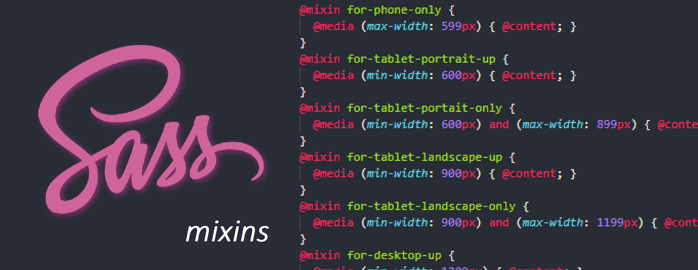

# Media Queries



CSS Media queries allow us to render styles dynamically based on certain criteria. For example we can dynamically render styles based on if a condition is met such as if the screen resolution is greater or less than a specific size:

```scss
@media (max-width: 599px) {
 font-size: 1rem;
}
```

We can use `mixins` to organize and structure our media query criteria, for example:

```scss
@mixin for-phone-only {
  @media (max-width: 599px) { @content; }
}
@mixin for-tablet-portrait-up {
  @media (min-width: 600px) { @content; }
}
@mixin for-tablet-landscape-up {
  @media (min-width: 900px) { @content; }
}
@mixin for-desktop-up {
  @media (min-width: 1200px) { @content; }
}
@mixin for-big-desktop-up {
  @media (min-width: 1800px) { @content; }
}
```

**NOTE:** The `@content` syntax is a directive that allows for the insertion of content later on. (placeholder)

To make use of this `@content` directive, we will declare the style when the mixin is used. For example:

```scss
.header-title {
    font-size: 2rem;

    @include for-phone-only {
        font-size: 1rem; // *
    }
}

// *
// This line of code will compile down to the below code:
@media (max-width: 599px) {
    font-size: 1rem;
}

// It will replace the @content directive in the mixins defined above. Specifically for the for-phone-only mixin
```

A big plus side to this setup is that we will not need to memorize our breakpoints as we will have a pre-defined system for them, and if we wish to alter them we can simply edit the system of mixins controlling our breakpoints and everything downstream will be updated.

<br />

### Taking the media query management system to the next level

We can combine our `@mixins` with our `@control` directive symbols. We can create a single mixin block that will take in a parameter that will represent the size we want to cater for and it will decide which breakpoint to use.

EG)

```scss
@mixin for-size($size) {
  @if $size == phone-only {
    @media (max-width: 599px) { @content; }
  } @else if $size == tablet-portrait-up {
    @media (min-width: 600px) { @content; }
  } @else if $size == tablet-landscape-up {
    @media (min-width: 900px) { @content; }
  } @else if $size == desktop-up {
    @media (min-width: 1200px) { @content; }
  } @else if $size == big-desktop-up {
    @media (min-width: 1800px) { @content; }
  }
}

// Implementation
.header-title {  
   font-size: 2rem;  
 
   @include for-size(phone-only) {    
      font-size: 1rem; 
   }
}
```