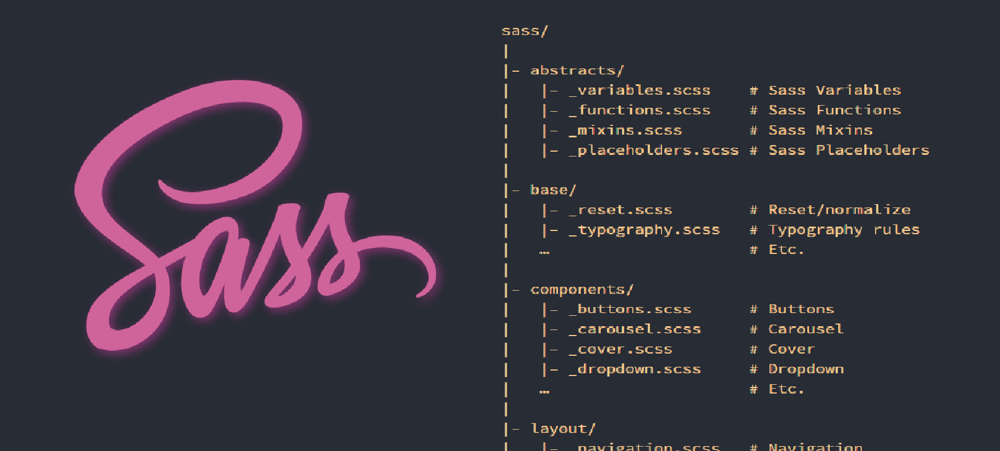

# Structuring Sass projects



<br />

We should strive to create modular style code as the sass code can be imported and used across multiple projects, adding further structure and organization to your style library.

A normal structure will look like the image above. In its simplest form it will look like this:

- main.scss
  - component1.scss
  - component2.scss
  - etc ...

```scss
_base.scss
_layout.scss
_components.scss
main.scss
```

**_<font color=gold>NOTE: In this structure the main.scss file should ONLY contain the imports for the component styles defined above it</font>_**

<br />

### 7 - 1 Pattern (Industry Standard Pattern)

This stands for *7 folders and 1 file*.

The 7 folders will contain all our mixin's, components, layouts, variables, etc... and we will *have 1 file in the root of the application (main.scss) that will hold all of our imports, this is the file that will compile everything into base CSS.*

Here is an example of this 7 - 1 Pattern directory structure:

```scss
sass/
|
|– abstracts/ (or utilities/)
|   |– _variables.scss    // Sass Variables
|   |– _functions.scss    // Sass Functions
|   |– _mixins.scss       // Sass Mixins
|
|– base/
|   |– _reset.scss        // Reset/normalize
|   |– _typography.scss   // Typography rules
|
|– components/ (or modules/)
|   |– _buttons.scss      // Buttons
|   |– _carousel.scss     // Carousel
|   |– _slider.scss       // Slider
|
|– layout/
|   |– _navigation.scss   // Navigation
|   |– _grid.scss         // Grid system
|   |– _header.scss       // Header
|   |– _footer.scss       // Footer
|   |– _sidebar.scss      // Sidebar
|   |– _forms.scss        // Forms
|
|– pages/
|   |– _home.scss         // Home specific styles
|   |– _about.scss        // About specific styles
|   |– _contact.scss      // Contact specific styles
|
|– themes/
|   |– _theme.scss        // Default theme
|   |– _admin.scss        // Admin theme
|
|– vendors/
|   |– _bootstrap.scss    // Bootstrap
|   |– _jquery-ui.scss    // jQuery UI
|
`– main.scss              // Main Sass file
```

Let's break down the directory use cases:

- Abstract (or utilities)

    This will contain our functions, mixins, helper files and config files. This dir will house files that do not output CSS.

- Base

    Contains the boilerplate styles for the project. Like standard styles such as typography rules and variables.

- Components (or modules)

    Contains all the components based styles and variants. For example button, carousels, sliders and toggles styles. If your application is created with a good structure this dir will be the most populated with files.

- Layout

    Contains all styles that are involved with the layout of your projects. For example headers, footers, navigation, grids, and general page layouts.

- Pages

    This is a dir that will hold files that have styles that are specific to individual pages. For example your contact page will use different styles from your home splash page. Here this split will be made.

- Themes

    This directory will hold the alternative variable themes for your application. For example light mode, dark mode and colour blind mode.

- Vendor

    This is used to house all third party integrations and external libraries or frameworks such as, bootstrap, tailwind, Normalize etc.

    If we ever need to create overrides for styles provided by these third party libraries, we need to create an extension directory to use these overrides. *(vendors_extensions)*

    For example the file ***vendors-extensions/_bootstrap.scss***:

    Will contain all your bootstrap styling overrides, as we should not edit the third party files directly.

- Main.scss

    This file as mentioned before should ONLY contain our imports:

    ```scss
    @import 'abstracts/variables';
    @import 'abstracts/functions';
    @import 'abstracts/mixins';

    @import 'vendors/bootstrap';
    @import 'vendors/jquery-ui';

    @import 'base/reset';
    @import 'base/typography';

    @import 'layout/navigation';
    @import 'layout/grid';
    @import 'layout/header';
    @import 'layout/footer';
    @import 'layout/sidebar';
    @import 'layout/forms';

    @import 'components/buttons';
    @import 'components/carousel';
    @import 'components/slider';
    @import 'components/images';

    @import 'pages/home';
    @import 'pages/about';
    @import 'pages/contact';

    @import 'themes/theme';
    @import 'themes/admin';
    ```
<br />

## [Use this repo to quickly set up this structure for your new applications](https://github.com/HugoGiraudel/sass-boilerplate.git) -> Git Clone it

<br />

# Sass build processes

This Sass build process


Compilation is the process of building our application and converting all of our styles to base css, so that we can have production ready code.

<br />

### Concatenation

[Here is an example of this step](https://www.educative.io/courses/sass-for-css/concatenation).

This process normally involves us adding additional styling to our main styling file when we need to add information to the stylesheet.

<br />

### Prefixing

This is the processing of auto prefixing our style sheets so that we can use experimental css properties before they are made standard. These are our Vendors code/prefixes or experimental features.

The plus side here is that you can use extremely cool cutting edge style tech, while the down side is that the experimental feature may never be implemented in the CSS package and may be discontinued.

With prefixes we add all vendor prefixes so that we can automatically ensure that the code is functional across all major browsers. IE)

```scss
.myClass {
    -webkit-transition: all 10s linear;
    -moz-transition: all 10s linear;
    -ms-transition: all 10s linear;
    -o-transition: all 10s linear;
    transition: all 10s linear;
}
```

***NOTE:*** Using an autoprefixer will automatically generate these `-{browser}` style lines to ensure that our styles remain cross-browser compatible without us needing to worry if a style needs prefixing or not.

[This npm package is normally used when we want to prefix our styles](https://www.npmjs.com/package/autoprefixer). [<font color=cyan>This is normally paired with `PostCSS` to achieve this logic</font>](https://www.npmjs.com/package/postcss)

<br />

### Compression

This is the step where we compress our code and minimize it to maximize performance. Think compiling JS bundles of code that will be shipped to the browser. It works the same way here.

The style code will be minified and uglified to significantly reduce our page load times. The browser does not need our well formatted code, it already understands what its been given.


<br />

## Additional NOTES

We can use the [npm-run-all](https://www.npmjs.com/package/npm-run-all) package to run multiple npm scripts at the same time. We also guaranty that this will work on all operating systems as well. We do not need to worry about Operating system compatibility.